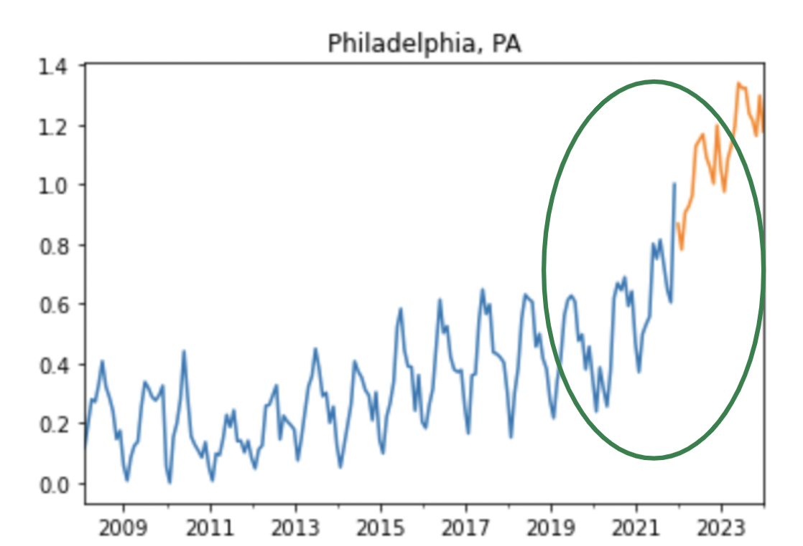

## trending real estate markets

    Brad Blackwood
    Phase 4 Project
    2022-02-18


### purpose
    
The goal of this project is to model volumetric trends of real estate markets. 

### buisness understanding

Being able to identifiy emerging real estate markets early could potentially lead to great investment opertunities. Houseing volume data was best suited for this as a leading indicator. 


### overview

The data was collected from https://www.zillow.com/research/data/. It contains number of condo units sold per month in 95 different Metropolitan areas. Time series modeling was choosen to be the most appropriate method to make predictions using the data. To compare different areas it was important to establish baseline parameters, this was done using the 'United States' regional data. Each region was then modeled and a slope of the predictios was taken to rank the regions. A higher slope represents a stronger positive trend in volume. A mean percent error was taken as a method to validate the data. Scaling of the data was determined to be appropriate given comparisons between volume of regions were significantly different. Future trends were then forcasted and ranked based on a 2 year slope. Top and bottom rankings were then visualized and compared between the models. 



### imports

```python
import pandas as pd
import matplotlib.pyplot as plt
from statsmodels.tsa.arima.model import ARIMA
from statsmodels.tsa.api import SARIMAX
import statsmodels.api as sm
from statsmodels.graphics.tsaplots import plot_pacf
from statsmodels.graphics.tsaplots import plot_acf
from statsmodels.tsa.stattools import adfuller
import warnings
from sklearn.preprocessing import StandardScaler, MinMaxScaler
from sklearn.linear_model import LinearRegression
import numpy as np
```

### repository
```
├── Zillow_ts_working.ipynb
├── README.md
├── data
│   └── Metro_sales_count_now_uc_sfrcondo_month.csv
├── dataframes
│   ├── mm_forcasts_df.pkl
│   ├── slope_validation_df.pkl
│   ├── ss_forcasts_df.pkl
│   └── ts_forcasts_df.pkl
├── images
│   ├── monopoly_img.jpeg
│   ├── philly.png
│   └── zillow.png
└── presentation.pdf
```
    
